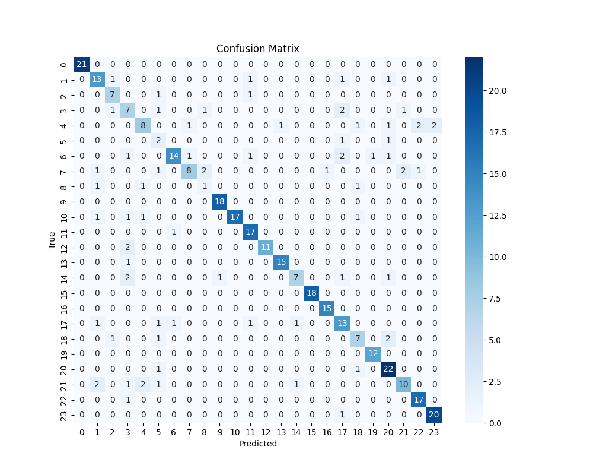
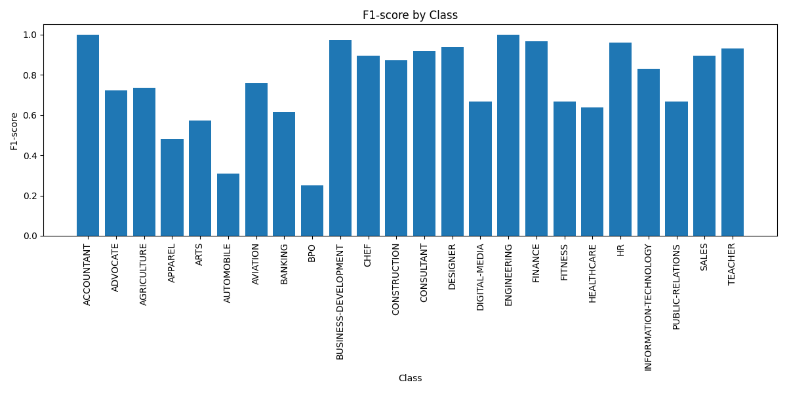
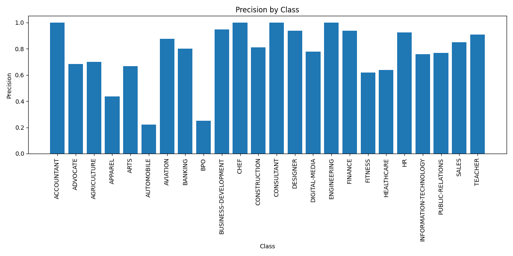
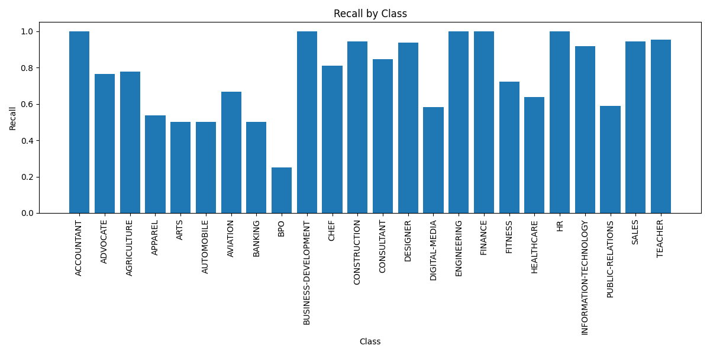

# Resume Categorization Project

This project provides a tool for automatically categorizing resumes using a pre-trained RoBERTa model. It processes PDF resumes, categorizes them, and organizes them into folders based on their predicted categories.

## Table of Contents
- [Features](#features)
- [Requirements](#requirements)
- [Installation](#installation)
- [Usage](#usage)
- [Project Structure](#project-structure)
- [Model Details](#model-details)
  - [Chosen Model](#chosen-model-roberta)
  - [Preprocessing and Feature Extraction](#preprocessing-and-feature-extraction)
- [Performance Metrics](#performance-metrics)
- [Contributing](#contributing)
- [License](#license)

## Features

- Automatic categorization of PDF resumes
- Organized output with category-based folders
- Generation of a CSV file with categorization results
- Utilizes a fine-tuned RoBERTa model for accurate predictions

## Requirements

- Python 3.7+
- PyTorch
- Transformers
- pandas
- scikit-learn
- tqdm
- PyPDF2

For a complete list of requirements, see the `requirements.txt` file.

## Installation

1. Clone this repository:
   ```
   git clone https://github.com/mridul404/Resume-Categorization-NLP.git
   cd Resume-Categorization-NLP
   ```

2. Install the required packages:
   ```
   pip install -r requirements.txt
   ```

## Usage

To categorize a directory of resumes:

```
python src/script.py /path/to/resume/directory
```

This will:
1. Process all PDF files in the specified directory
2. Categorize each resume
3. Copy categorized resumes to category-specific folders in the `output` directory
4. Generate a `categorized_resumes.csv` file in the `output` directory with the results

## Project Structure

```
project_root/
├── src/
│   ├── script.py
│   └── utils.py
├── model/
│   └── resume_categorization_model.pth
├── dataset/
│   └── Resume.csv
├── output/
│   ├── categorized_resumes.csv
│   └── [category folders]/
├── images/
│   ├── confusion_matrix.png
│   ├── f1-score_by_class.png
│   ├── precision_by_class.png
│   └── recall_by_class.png
├── notebook/
│   ├── resume_categorization_dl.ipynb
│   └── resume_categorization_ml.ipynb
├── requirements.txt
└── README.md
```
## Model Description

### Chosen Model: RoBERTa

For this resume categorization project, I chose to use the RoBERTa (Robustly Optimized BERT Approach) model, specifically the `roberta-base` variant.

#### Rationale for Selection:

1. **Advanced Language Understanding**: RoBERTa is an optimized version of BERT, which has shown state-of-the-art performance in various natural language processing tasks. Its ability to understand context and nuances in text makes it well-suited for categorizing resumes, which often contain industry-specific jargon and complex language structures.

2. **Pre-training on Diverse Corpora**: RoBERTa was pre-trained on a large and diverse corpus of text, which allows it to have a broad understanding of language across various domains. This is particularly useful for resume categorization, as resumes can span multiple industries and job roles.

3. **Robust Performance**: RoBERTa has demonstrated superior performance compared to its predecessors in many benchmarks, indicating its robustness and reliability.

4. **Fine-tuning Capabilities**: The model's architecture allows for efficient fine-tuning on specific tasks, which enabled us to adapt it to our resume categorization task with relatively small amounts of labeled data.

5. **Handling of Long Sequences**: RoBERTa can handle sequences of up to 512 tokens, which is suitable for processing the typically long and detailed content of resumes.

### Preprocessing and Feature Extraction

Our preprocessing and feature extraction pipeline consists of the following steps:

1. **Text Extraction**: 
   - I use PyPDF2 to extract raw text from PDF resumes.
   - This step converts the visual PDF format into plain text that can be processed by our NLP model.

2. **Text Cleaning**:
   - Remove special characters and numbers using regex: `re.sub(r'[^a-zA-Z\s]', '', text)`
   - Convert all text to lowercase: `text.lower()`
   - Remove extra whitespace: `' '.join(text.split())`

3. **Tokenization**:
   - I use the RoBERTa tokenizer from the Transformers library to convert the cleaned text into tokens.
   - The tokenizer splits the text into subwords, handling out-of-vocabulary words effectively.

4. **Feature Extraction**:
   - The RoBERTa model itself acts as our feature extractor.
   - It converts the tokenized text into high-dimensional embeddings that capture semantic and contextual information.
   - These embeddings are then used as input features for the classification layer.

5. **Input Formatting**:
   - I truncate or pad the tokenized sequences to a maximum length of 256 tokens.
   - This ensures a consistent input size for our model while capturing the most relevant information from each resume.

By using RoBERTa's pre-trained weights and fine-tuning on our specific task, we leverage transfer learning to achieve high performance in resume categorization with relatively little task-specific training data.

This preprocessing and feature extraction pipeline, combined with the power of the RoBERTa model, allows us to effectively capture the nuanced information in resumes and accurately categorize them into relevant job categories.

## Performance Metrics

Model's performance is evaluated using various metrics:

### Confusion Matrix



This matrix shows the model's prediction accuracy across different categories.

### F1-Score by Class



The F1-score is the harmonic mean of precision and recall, providing a balanced measure of the model's performance for each class.

### Precision by Class



Precision measures the accuracy of positive predictions for each class.

### Recall by Class



Recall measures the model's ability to find all positive instances of each class.

These metrics provide a comprehensive view of our model's performance across different resume categories.
